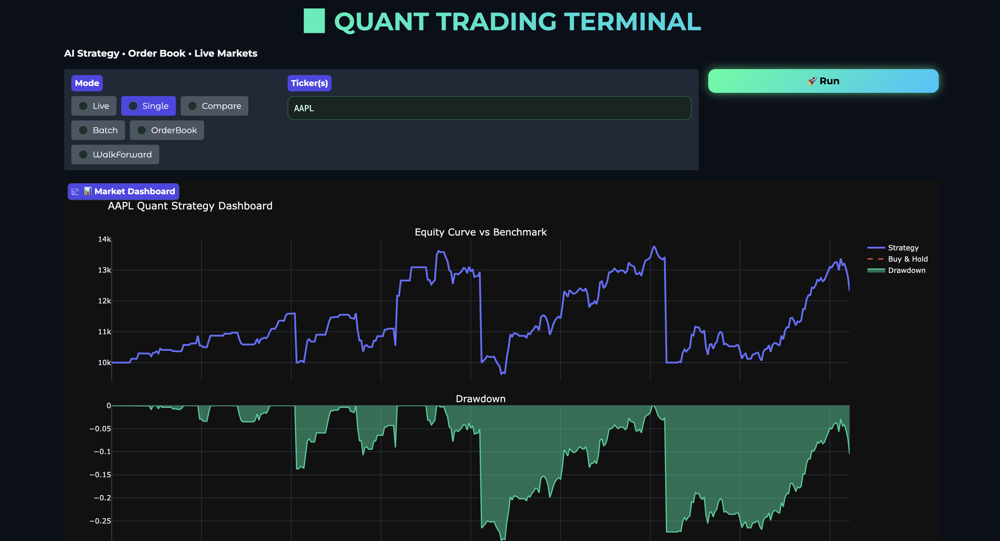
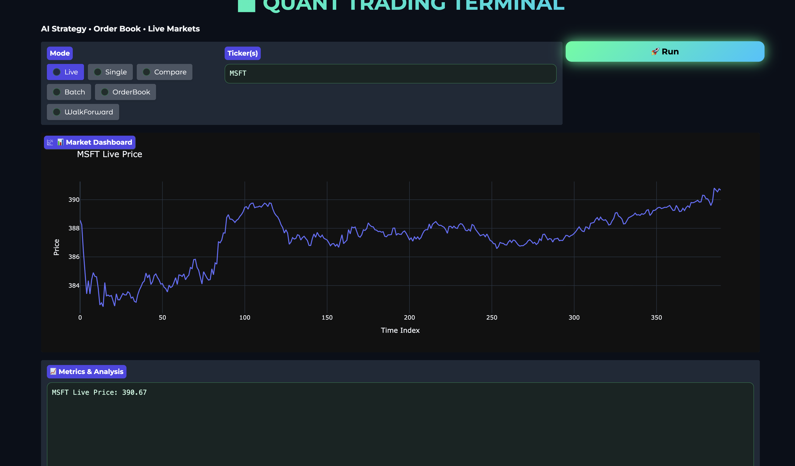
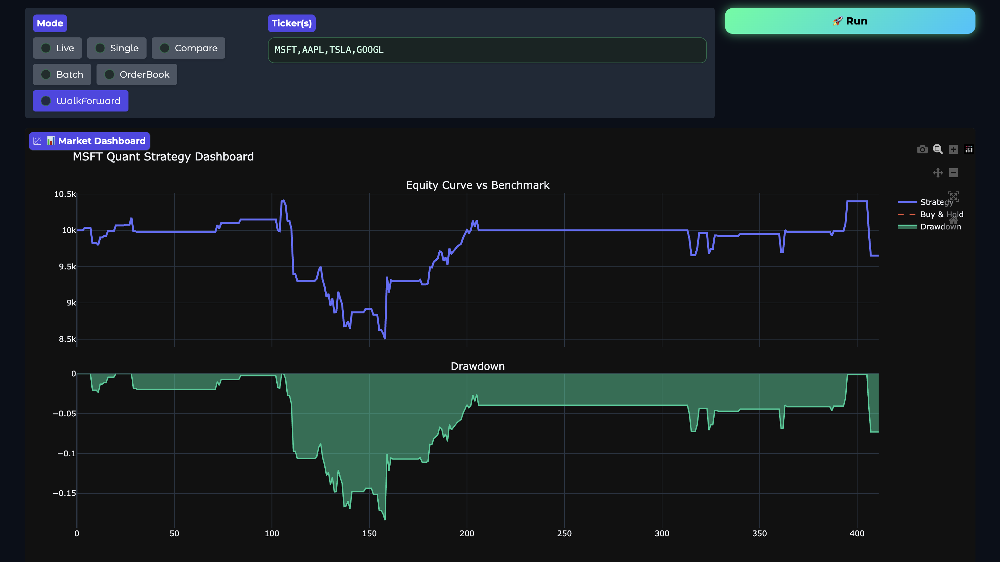
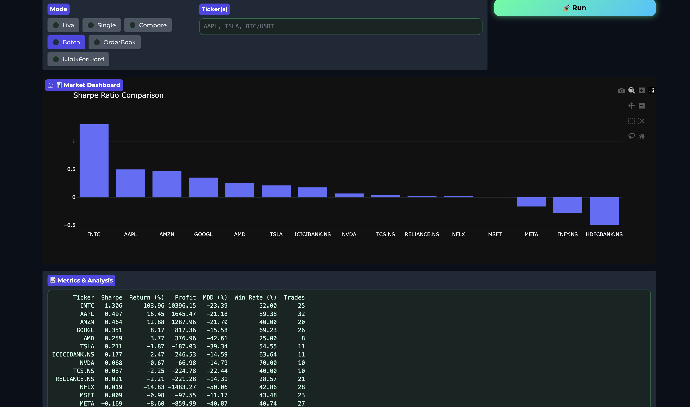
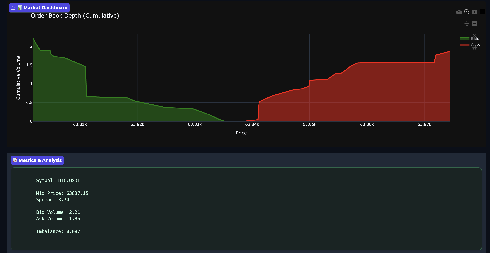
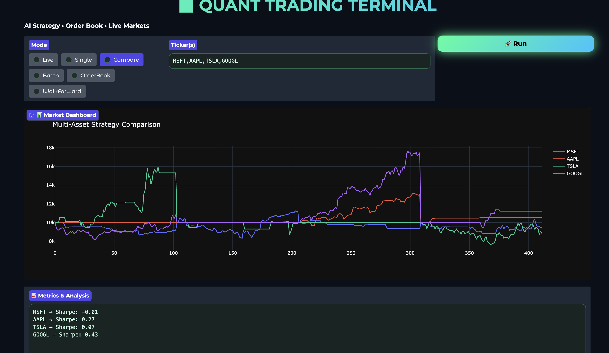

# 🚀 Quant Trading Terminal

### AI-Powered Quantitative Trading Research & Portfolio Analytics Platform



---

# Overview

Quant Trading Terminal is an advanced quantitative trading research platform designed to assist traders, researchers, and algorithmic trading enthusiasts in developing, evaluating, and monitoring systematic trading strategies.

The platform combines financial data engineering, deep learning forecasting, market microstructure analysis, portfolio analytics, and interactive visualization into a single unified environment.

Unlike traditional retail trading tools, this system incorporates:

* Deep Learning-based forecasting
* Technical factor engineering
* Walk-forward validation
* Market microstructure analysis
* Order book imbalance detection
* Portfolio performance evaluation
* Multi-asset strategy comparison
* Live market monitoring
* Interactive dashboards

The project serves as both a research environment and a strategy evaluation framework.

---

# Project Objectives

The primary objectives of this project are:

### 1. Market Prediction

Predict future market behavior using deep learning models trained on historical market data.

### 2. Strategy Development

Enable rapid experimentation with quantitative trading strategies.

### 3. Risk Management

Evaluate strategy risk using professional performance metrics.

### 4. Portfolio Analytics

Analyze portfolio performance against benchmark strategies.

### 5. Market Microstructure Research

Utilize order book information and liquidity analysis to improve trading decisions.

### 6. Real-Time Monitoring

Provide live price tracking and market visualization.

### 7. Institutional Research Workflow

Simulate workflows commonly used by hedge funds, proprietary trading firms, and quantitative research teams.

---

# System Architecture


```text
Market Data Sources
        │
        ▼
Data Collection Layer
        │
        ▼
Feature Engineering Layer
        │
        ▼
Deep Learning Model
        │
        ▼
Prediction Engine
        │
        ▼
Backtesting Engine
        │
        ▼
Portfolio Analytics
        │
        ▼
Visualization Dashboard
        │
        ▼
User Interface (Gradio)
```

---

# Core Features

## Historical Data Collection

The platform retrieves historical market data using Yahoo Finance.

Supported assets include:

* Stocks
* ETFs
* Indian Equities
* Global Equities

Examples:

* AAPL
* MSFT
* TSLA
* NVDA
* RELIANCE.NS
* TCS.NS
* INFY.NS

---

## Live Market Data

Real-time market prices are collected for monitoring and visualization.

Features:

* Live price tracking
* Minute-level updates
* Real-time plotting
* Live dashboard updates

---

## Cryptocurrency Order Book Analysis

The system connects to cryptocurrency exchanges using CCXT.

Current implementation includes:

* Kraken Exchange Integration

Features:

* Bid/Ask extraction
* Liquidity monitoring
* Market depth analysis
* Order book imbalance detection

---

## Technical Factor Engineering

The platform generates quantitative features used by the deep learning model.

Implemented Factors:

### Momentum

Measures directional strength of price movement.

### Returns

Percentage price change.

### Volatility

Rolling standard deviation of returns.

### EMA Fast

Short-term exponential moving average.

### EMA Slow

Long-term exponential moving average.

### RSI

Relative Strength Index.

### MACD

Moving Average Convergence Divergence.

### Signal Line

MACD signal smoothing indicator.

### Volume Z-Score

Detects abnormal trading activity.

---

# Feature Pipeline



```text
Raw OHLCV Data
        │
        ▼
Returns
Momentum
Volatility
EMA
RSI
MACD
Volume Features
        │
        ▼
Normalization
        │
        ▼
Sequence Creation
        │
        ▼
Deep Learning Model
```

---

# Deep Learning Engine

## Temporal Convolutional Network (TCN)

The project uses a Temporal Convolutional Network architecture.

Why TCN?

* Faster training than RNNs
* Better parallelization
* Strong time-series performance
* Stable gradients

Architecture:

```text
Input Features
      │
      ▼
Conv1D Layer
      │
      ▼
ReLU
      │
      ▼
Conv1D Layer
      │
      ▼
ReLU
      │
      ▼
Fully Connected Layer
      │
      ▼
Prediction
```

---

# Prediction Engine

The trained model predicts future market movement based on:

* Historical returns
* Trend strength
* Volatility
* Momentum
* Market volume
* Technical indicators

Predictions are transformed into actionable trading signals.

---

# Trading Logic

## Buy Signal

Generated when:

```python
Prediction > Threshold
```

and market conditions are favorable.

---

## Sell Signal

Generated when:

```python
Prediction < Threshold
```

or exit conditions are triggered.

---

## Order Book Confirmation

For cryptocurrencies:

* Bullish imbalance → Long confirmation
* Bearish imbalance → Exit confirmation

---

# Backtesting Engine



The backtesting framework simulates historical trading performance.

Features:

* Trade execution simulation
* Position management
* Capital tracking
* Equity curve generation
* Trade logging

Initial Capital:

```text
$10,000
```

---

# Walk-Forward Validation

One of the strongest components of the project.

Instead of training once and testing once:

```text
Train
Test
Retrain
Retest
Repeat
```

Benefits:

* Reduces overfitting
* Mimics real-world deployment
* Produces realistic performance estimates

---

# Performance Metrics

The system calculates institutional-grade metrics.

### Sharpe Ratio

Risk-adjusted return measurement.

### Total Return

Overall strategy growth.

### Profit

Absolute profit generated.

### Volatility

Portfolio risk measurement.

### Maximum Drawdown

Worst portfolio decline.

### Win Rate

Percentage of profitable trades.

### Average Trade Return

Mean return per trade.

### Trade Count

Total executed trades.

---

# Portfolio Analytics Dashboard



Visualizations include:

### Equity Curve

Portfolio growth over time.

### Buy-and-Hold Comparison

Benchmark performance comparison.

### Drawdown Curve

Risk visualization.

### Multi-Asset Comparison

Strategy performance across assets.

---

# Order Book Visualization



Displays:

* Bid depth
* Ask depth
* Cumulative volume
* Market liquidity
* Imbalance analysis

Useful for:

* Scalping
* Short-term trading
* Liquidity research

---

# Factor Attribution Analysis



The platform estimates feature importance by measuring prediction sensitivity.

Provides insight into:

* Most influential indicators
* Model behavior
* Feature contribution

Examples:

* RSI Impact
* MACD Impact
* Momentum Impact
* Volume Impact

---

# Multi-Asset Research Module

The platform can compare multiple assets simultaneously.

Example:

```python
AAPL
MSFT
NVDA
TSLA
RELIANCE.NS
```

Outputs:

* Sharpe comparison
* Profit comparison
* Return comparison
* Strategy rankings

---

# Interactive User Interface

Built using Gradio.

Capabilities:

* Asset selection
* Strategy execution
* Dashboard visualization
* Live market monitoring
* Analytics reporting

Benefits:

* No coding required
* Easy experimentation
* Research-friendly workflow

---

# Technology Stack

## Programming Language

* Python

## Deep Learning

* PyTorch

## Financial Data

* Yahoo Finance

## Crypto Exchange API

* CCXT

## Numerical Computing

* NumPy

## Data Processing

* Pandas

## Visualization

* Plotly
* Matplotlib

## Interface

* Gradio

---

# Future Improvements

Potential upgrades:

### Transformer Models

Replace TCN with:

* Transformer
* Informer
* TimeGPT
* PatchTST

### Reinforcement Learning

Implement:

* PPO
* DQN
* SAC

### Portfolio Optimization

Add:

* Mean Variance Optimization
* Risk Parity
* Black-Litterman

### Sentiment Analysis

Integrate:

* News sentiment
* Social media sentiment
* Earnings call analysis

### Multi-Exchange Trading

Support:

* Binance
* Coinbase
* Bybit
* OKX

### Automated Execution

Enable live trading through broker APIs.

---

# Research Applications

Suitable for:

* Quantitative Finance Research
* Algorithmic Trading
* Portfolio Management
* Financial Machine Learning
* Cryptocurrency Market Research
* Market Microstructure Analysis
* Trading Strategy Development

---

# Disclaimer

This project is intended only for educational, research, and experimental purposes.

It does not constitute financial advice, investment recommendations, or guarantees of future performance.

Trading financial markets involves substantial risk and may result in loss of capital.

---

# Author

Developed as a quantitative trading research platform combining financial engineering, machine learning, market analytics, and algorithmic trading methodologies.

⭐ If you find this project useful, please consider giving it a star.
